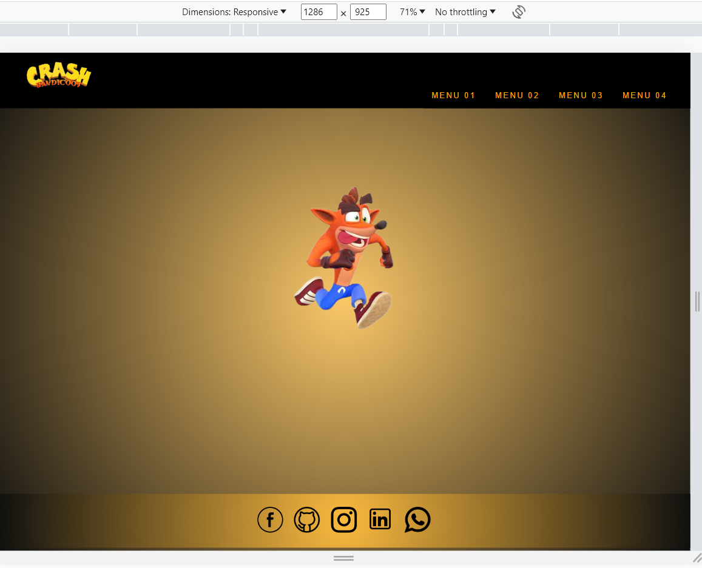
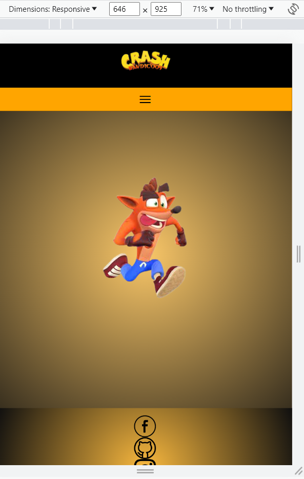

# menu-hamb-rguer ☰

Como parte do aprendizado constante promovido pela ElasNaTech, consegui concluir um desafio empolgante. Durante essa experiência, pude aplicar meus conhecimentos em CSS, HTML e JavaScript para fortalecer e consolidar o que aprendi até agora.

O projeto consiste em uma página da web de design adaptável, onde se destaca a criação de um inovador menu de hambúrguer. Essa experiência me proporcionou a oportunidade de trabalhar na implementação de conceitos-chave, ao mesmo tempo em que reforçava minha compreensão prática dessas linguagens fundamentais.

À medida que avanço em minha jornada de aprendizado com a ElasNaTech, estou empolgada para continuar enfrentando desafios semelhantes e constantemente ultrapassar meus limites na criação de soluções web eficazes e visualmente atraentes.

 ## Desenvolvedora

Ninoska Contreras

 

  Ferramentas e tecnologias utilizadas:  

  <a href="https://developer.mozilla.org/en-US/docs/Learn/Getting_started_with_the_web/HTML_basics">
  
  <a href="https://developer.mozilla.org/en-US/docs/Web/CSS">
  
   <a href="https://developer.mozilla.org/en-US/docs/Learn/JavaScript/First_steps/What_is_JavaScript">
  
  <a href="https://git-scm.com/">
  
  

